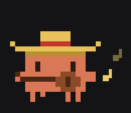
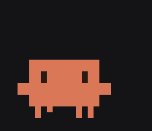
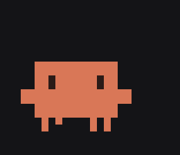
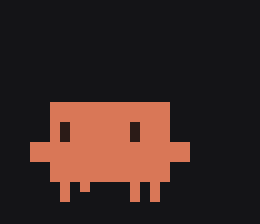
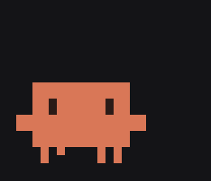
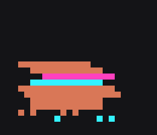
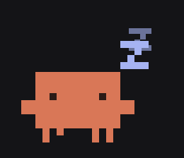

<div align="center">



# Claude Companion

**A tiny pixel Clawd that lives on your Mac desktop and opens Claude or Claude Code in one move.**

macOS 13+ · Swift · no dependencies

</div>

> Unofficial fan project, not affiliated with Anthropic. Clawd is the Claude Code mascot from the CLI banner.

## What it does

Pixel sits on top of all your windows. Hover it and a small capsule pops up with two icons:

- **Claude** — opens the desktop app;
- **Claude Code** — opens a new session in the Code tab.

The rest of the time it just lives there: blinks, shuffles its legs, gets bored and does tricks.

| | | | |
|:-:|:-:|:-:|:-:|
| <br>idle | <br>jump | <br>wave | <br>look around |
| <br>shiver | <br>glitch | <br>fiesta 🎸 | <br>sleep |

## Features

- floats above all windows on every Space; drag it anywhere, it remembers the spot;
- a random trick every 8–25 seconds when idle — walks off sideways, jumps, shivers, waves, glitches, or puts on a sombrero and plays guitar;
- blushes and looks up on hover, falls asleep after 5 minutes without attention;
- **double click** — it glitches; **drag** it and its legs run in the air;
- **double Option** from any app shows the capsule;
- **voice** — Claude voice input via Caps Lock, Pixel flaps its arms while you talk;
- right click / menu bar icon: voice, open Claude / Claude Code, hide, sleep, fiesta, back to corner, quit;
- runs as a LaunchAgent: starts at login, restarts after a crash.

## Install

Requires macOS 13+, Swift 5.10+ (Xcode or Command Line Tools) and [Claude Desktop](https://claude.ai/download).

```bash
git clone https://github.com/bogdanminko/claude-companion.git
cd claude-companion
make install
```

Then grant **Accessibility** access (needed for double Option and the Caps Lock voice key):
System Settings → Privacy & Security → Accessibility → enable **Claude Companion**. No restart needed.

> The build is ad-hoc signed, so macOS asks for access again after every reinstall —
> `install.sh` resets the stale entry for you.

For voice, enable Caps Lock voice input in Claude settings.

## Commands

| Command | What it does |
| --- | --- |
| `make install` | build, copy to `~/Applications`, register the LaunchAgent |
| `make run` | build and run without installing |
| `make restart` | restart the agent |
| `make logs` | tail `/tmp/claude-companion.*.log` |
| `make uninstall` | stop and remove |
| `make preview` | render all sprite states to `build/preview.png` |
| `make demo` | re-record the GIFs in `docs/` |
| `make icon` | regenerate `Resources/AppIcon.icns` from the sprite |

## How it works

```
Sources/ClaudeCompanion/
  main.swift                 — entry point, no Dock icon
  AppDelegate.swift          — menu bar and context menu
  CompanionPanel.swift       — transparent floating window
  CompanionView.swift        — moods, tricks, animation, mouse
  PixelSprite.swift          — Clawd, 18×10 pixels, block for block from the CLI banner
  BubblePanel.swift          — Claude / Claude Code capsule
  DoubleOptionDetector.swift — global double Option
  ClaudeApp.swift            — opening Claude (claude://code/new), Caps Lock voice
tools/                       — sprite preview, demo GIF recorder, icon generator
launchd/                     — LaunchAgent template
scripts/                     — build / install / uninstall
```

The sprite is drawn in code, no image assets. Each quadrant of the CLI banner `▐▛███▜▌ / ▝▜█████▛▘ / ▘▘ ▝▝`
becomes two square pixels (terminal cells are twice as tall as wide). Change shapes in `PixelSprite.swift`, check with `make preview`.

`KeepAlive` is `SuccessfulExit = false`: Quit closes it until next login, a crash restarts it.

## License

[MIT](LICENSE)
